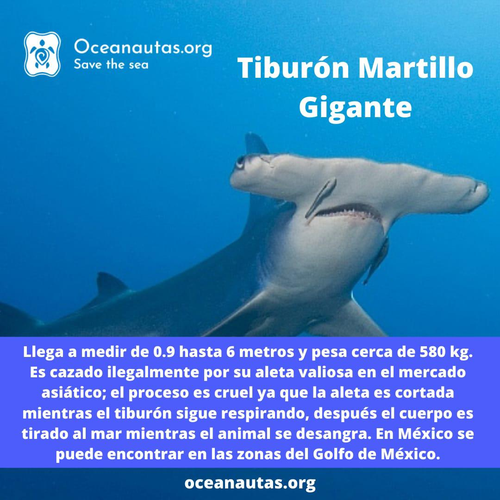

# Conservacion de Especies Marinas :turtle:

## problematica

---

Alguna vez se han puesto a pensar en como las especies marinas cada vez se encuentran en peligro de extinción, por lo que hemos decidido enfocar su investigación en el tema de la extinción de especies marinas, para saber mas acerca del habitad en el que se encuentran, la calidad del agua entre otros factores. Muchas especies se han visto amenzadas por el hombre devido a la pesca ilegal o por la contaminacion de mares y rios.

## Solución Propuesta

---

Estudiado el caso anteriormente llegamos a una conclusión de crear una landing page para poder mostrar un poco sobre algunas especies que se encuentran gravemente en peligro de extición, añadiendo imagenes para que conozcan mas sobre la especie. Cuenta con un mapa en el cual se pueden visualizar donde se encuentran el habitad de las especies maritimas en el territorio Mexicano.

Tambien contamos con una webApp la cual nos permite crear registros de avistamientos de especies marinas, para que puedan ser visualizados por el usuario; ademas de una sección de registro de biologos para saber cuantas especies ha estudiado y que ha hecho con ellas, todo esto cuidado por un login para proteger un poco mas la informacion.

## Teconologias Utilizadas

---

- Node
- Express
- PostgressSQL
- Vue
- Axios
- Prisma
- Linter
- Netlify
- Jest
- Supabase.io

## Visualizacion del proyecto

---

## De manera Local

### Project setup

```
npm install
```

### Compiles and hot-reloads for development

```
npm run serve
```

### Compiles and minifies for production

```
npm run build
```

### Lints and fixes files

```
npm run lint
```

## Desplegada

---

EL proyecto se encuentra en la siguiente direccion:

[Ver proyecto](https://oceanautas.netlify.app/#/)

## Seccion de Backend

---

La webApp tambien cuenta con una api la cual se encargar de manejar toda la informacion y guardarla en una base de datos, para que pueda ser visualizada por el usuario.

Esta se encuentra en el siguiente repositorio:
[Ver api](https://github.com/Urivan07/HackTheOceanBackend)

## Capturas del proyecto


## Campaña publicitaria par la difusion del proyecto

---




---

© Oceanautas 2022 :mexico:
